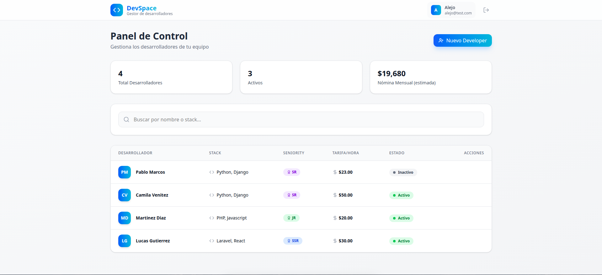
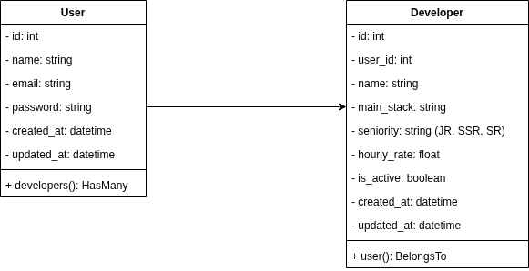

# Laravel + React CRUD Stack


A modern Fullstack application built with a decoupled architecture. This project uses **Laravel** as a robust REST API engine and **React** for a dynamic, high-performance user interface.

---

## Architecture

The project follows a **Separation of Concerns (SoC)** approach:

- **Backend:** Laravel-powered RESTful API.
- **Frontend:** Single Page Application (SPA) built with React and Vite.
- **Communication:** JSON data exchange via Axios.
- **Database:** PostgreSQL (Recommended) or MySQL.
- **Auth:** Planned implementation with Laravel Sanctum (Token-based).

---


## Preview

### Login Page


### Dashboard


---

## Architecture Diagram

To visualize how the React frontend interacts with the Laravel API and the PostgreSQL database, refer to the diagram below:



## Core Features & Implementation

### Authentication & Global State
- **`AuthContext.jsx`**: Implements React Context API to manage global authentication state, providing user data and login/logout functions across the app.
- **`ProtectedRoute.jsx`**: A higher-order component that secures frontend routes, redirecting unauthenticated users to the login page.
- **`AuthController.php`**: Backend logic for secure registration and token generation via Laravel Sanctum.

### Talent Management (CRUD)
- **`DeveloperController.php`**: Implements a **Resource Ownership** policy. 
    - `index()`: Scoped to return only developers linked to the `auth()->user()`.
    - `store()`: Uses the User-Developer relationship to auto-assign the `user_id`.
- **`StoreDeveloperRequest.php`**: Centralized validation logic for creating and updating developer records.

### Secure Communication
- **`api.js`**: Axios instance configured with base URL and interceptors.
- **`developerService.js`**: Encapsulates API calls for the developer resource, keeping components clean and focused on UI.

---

## Detailed Project Structure

```text
.
├── backend/
│   ├── app/
│   │   ├── Http/
│   │   │   ├── Controllers/
│   │   │   │   ├── Auth/AuthController.php      # Registration & Login
│   │   │   │   └── DeveloperController.php      # Scoped CRUD logic
│   │   │   └── Requests/
│   │   │       └── StoreDeveloperRequest.php    # Resource validation
│   │   └── Models/
│   │       ├── User.php                         # HasMany Developers
│   │       └── Developer.php                    # BelongsTo User
│   ├── database/
│   │   └── migrations/                          # Database schema definitions
│   └── routes/
│       └── api.php                              # Protected & Public endpoints
│
└── frontend/
    ├── src/
    │   ├── components/
    │   │   ├── Login.jsx                        # Auth entry point
    │   │   ├── ProtectedRoute.jsx               # Route guard
    │   │   ├── DeveloperList.jsx                # Reactive data table
    │   │   ├── DeveloperForm.jsx                # Multi-purpose form
    │   │   └── Dashboard.jsx                    # Main layout
    │   ├── context/
    │   │   └── AuthContext.jsx                  # Global Auth State
    │   ├── services/
    │   │   ├── api.js                           # Axios configuration
    │   │   └── developerService.js              # API abstraction
    │   └── main.jsx                             # React entry point
```

---

## Installation & Setup (Backend)

Follow these steps to get the project running locally.

### Prerequisites
- **PHP 8.5+** & **Composer**
- **Node.js** (LTS) & **NPM**
- **PostgreSQL** (Active service)

### Backend Setup (Laravel)
```bash
# Clone the repository
git clone https://github.com/AlejoPavon/laravel_react_crud.git
cd backend

# Install dependencies
composer install

# Configure Environment
cp .env.example .env 
```

### Application Key Generation
Generate the unique application key required for data encryption and secure sessions.

```bash
php artisan key:generate
```
### Database Creation (PostgreSQL)
Laravel cannot create the database for you. You must create it manually via your terminal or a database manager.

```bash
# Example using psql on Linux
sudo -u postgres psql -c "CREATE DATABASE your_database_name;"
```

### Database Credentials
Open the .env file and update the following lines with your PostgreSQL information:

```bash
DB_CONNECTION=pgsql
DB_HOST=127.0.0.1
DB_PORT=5432
DB_DATABASE=your_database_name
DB_USERNAME=your_username
DB_PASSWORD=your_password
```

### Migrations & Seeding
Once the database is ready and connected, run the migrations to create the tables and the seeders to populate initial data.

```bash
php artisan migrate --seed
```

### Launch the API
Start the local development server.

```bash
php artisan serve
```

> [!NOTE]  
> At this point, your API will be live at http://127.0.0.1:8000.

---

## Installation & Setup (Frontend)

### Navigate to the frontend directory:

```bash
cd ../frontend
```
### Install project dependencies:

```bash
npm install
```
### Launch the development server:

```bash
npm run dev
```

> [!NOTE]  
> At this point, your frontend will be live at http://127.0.0.1:5173.
